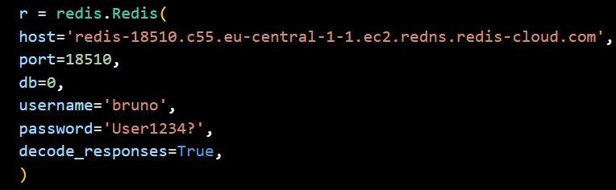

<a name="readme-top"></a>

<!-- TABLE OF CONTENTS -->
<details>
  <summary>Indice</summary>
  <ol>
    <li>
      <a href="#il-progetto">Il Progetto</a>
      <ul>
        <li><a href="#librerie">Librerie</a></li>
      </ul>
    </li>
    <li>
      <a href="#come-iniziare">Come iniziare</a>
      <ul>
        <li><a href="#prerequisiti">Prerequisiti</a></li>
        <li><a href="#installazioni">Installazioni</a></li>
        <li><a href="#avvio-del-software">Avvio del software</a></li>
      </ul>
    </li>
    <li><a href="#roadmap">Roadmap</a></li>
    <li><a href="#fonti">Fonti</a></li>
  </ol>
</details>


## Il Progetto

Questo progetto implementa un sistema di chat in tempo reale utilizzando Redis come backend per la memorizzazione dei dati e la gestione della messagistica in tempo reale.
L'applicazione consente agli utenti di effettuare le seguenti azioni:
1. Registrarsi
2. Effettuare la login
3. Aggiungere gli altri utenti alla propria rubrica
4. Eliminare gli utenti dalla propria rubrica
5. Avviare una chat e scrivere dei messaggi in tempo reale
6. Inserire una modalità dnd (Do Not Disturb) per evitare di ricevere messaggi durante un periodo di non disponibilità

Al fine di permetterci lo sviluppo di alcune funzionalità e per delle migliorie a livello grafico abbiamo effettuato delle modifiche rispetto al progetto originale:
1. Oltre al prefisso < per il sender ed il > per il receiver, abbiamo usato il colore rosso per il primo e l'azzurro per il secondo poiché solo il prefisso rendeva confusionaria la visualizzazione
2. Le chat, contrariamente a quanto richiesto, abbiamo preferito una visualizzazione dei messaggi più recenti in fondo poiché più conforme ad un software di messaggistica come whatsapp 
3. Con il comando pubsub abbiamo creato un canale di comunicazione tra due utenti in modo che essa sia in tempo reale e l'inserimento delle notifiche durante la chat 

<p align="right">(<a href="#readme-top">torna in cima</a>)</p>


### Librerie

- `redis`: Per interagire con il server Redis.
- `hashlib`: Per l'hashing della password.
- `os`: Per le operazioni di sistema
- `re`: Per la gestione delle espressioni regolari
- `time`: Per la gestione dei timestamp
- `threading`: Per la gestione delle concorrenze

<p align="right">(<a href="#readme-top">torna in cima</a>)</p>


## Come iniziare


### Prerequisiti

Prima di eseguire l'applicazione, assicurarsi di avere i seguenti prerequisiti installati:

1. **Python V 3.12:** Per installare la versione di python necessaria, potete scaricarlo dal sito ufficiale https://www.python.org/downloads/

2. **Server Redis:** Nel codice è già inserito un redis server Cloud per il salvataggio dei dati, se si vuole utilizzare un proprio server redis e visualizzare i dati, ci si può iscrivere gratuitamente al sito tramite il seguente link: https://redis.io/try-free/ .
Effettuata la registrazione si avrà a disposizione un proprio database gratuito con un limite di 30mb, selezionatelo e copiate il public endpoint di cui le cifre finali sono la porta
 
modificando le informazioni presenti nel modulo G2_whatsapp_project 



### Installazioni

1. Clonare la repository in locale
   ```sh
   git clone https://github.com/MarcoRogicITSRizzoli/G2_redis_project_.git
   ```
2. Installazione di pip
    Comando per Windows:
   ```sh
   py -m ensurepip --upgrade
   ```
   Comando per Mac:
   ```sh
   python3 -m ensurepip --upgrade
   ```
3. Installazione delle dipendenze
   ```sh
   pip install redis **questo vale per qualsiasi libreria di riferimento** 
   ```

<p align="right">(<a href="#readme-top">torna in cima</a>)</p>


### Avvio del software

Il modulo G2_whatsapp_project funge da contenitore del main per il lancio del software ma è possibile avviarlo direttamente da terminale

1. Avvio del software da terminale
    Comando per Windows
   ```sh
   py .\G2_whatsapp_project.py
   ```
   Comando per Mac
   ```sh
   python3 G2_whatsapp_project.py
   ```

<p align="right">(<a href="#readme-top">torna in cima</a>)</p>


<!-- ROADMAP -->
## Roadmap

- [x] *Ricerca degli utenti a sistema
- [x] *Aggiunta degli utenti nella propria rubrica
- [x] *Impostazione modalità Do Not Disturb
- [x] *Messaggistica con gli utenti nei contatti 
  - [x] *Messaggio di errore nel caso di invio di un messaggio ad un utente in modalità Do Not    Disturb
- [x] *Chat tra utenti con invio dei messaggi
  - [x] *Possibilità di creare una chat effimera della durata di 1 minuto
  - [x] *Chat con invio dei messaggi live
- [ ] *Creazione di un launcher per l'app
- [ ] *Supporto per l'invio di Media nelle chat


<p align="right">(<a href="#readme-top">torna in cima</a>)</p>


<!-- Fonti -->
## Fonti

Fonti consultate per la realizzazione del progetto

* [Documentazione per l'utilizo delle funzioni di redis](https://redis.io/docs/latest/develop/connect/clients/python/)
* [Documentazione di threading per la live chat](https://docs.python.org/3/library/threading.html)
* [Ringraziamo gli utenti di Stack Overflow di cui abbiamo seguito i thread per i diversi dubbi di progettazione](https://stackoverflow.com/)

<p align="right">(<a href="#readme-top">torna in cima</a>)</p>